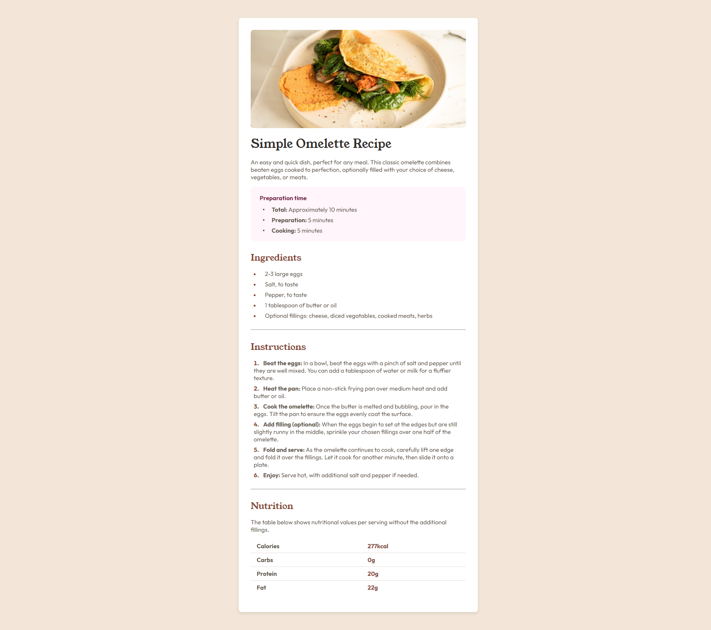
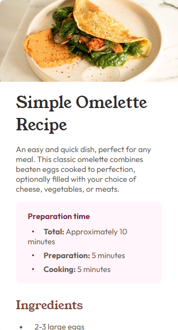

# Página de receta

Información sobre la receta y preparación de un Omelette Simple, los recursos utilizadas corresponden a la información brindada por el desafio de **Frontend Mentor**.

## Contenidos

- [Previsualización](#previsualización)
  - [Screenshot](#screenshot)
  - [Links](#links)
- [Proceso](#proceso)
  - [Hecho con](#hecho-con)

## Previsualización

### Screenshot

_Vista escritorio_

_Vista teléfono_

### Links

- Sitio: [Recipe Page](https://f-avalos.github.io/Recipe-Page/)

## Proceso

### Hecho con

- HTML
- CSS
  - Flexbox
  - Media Queries